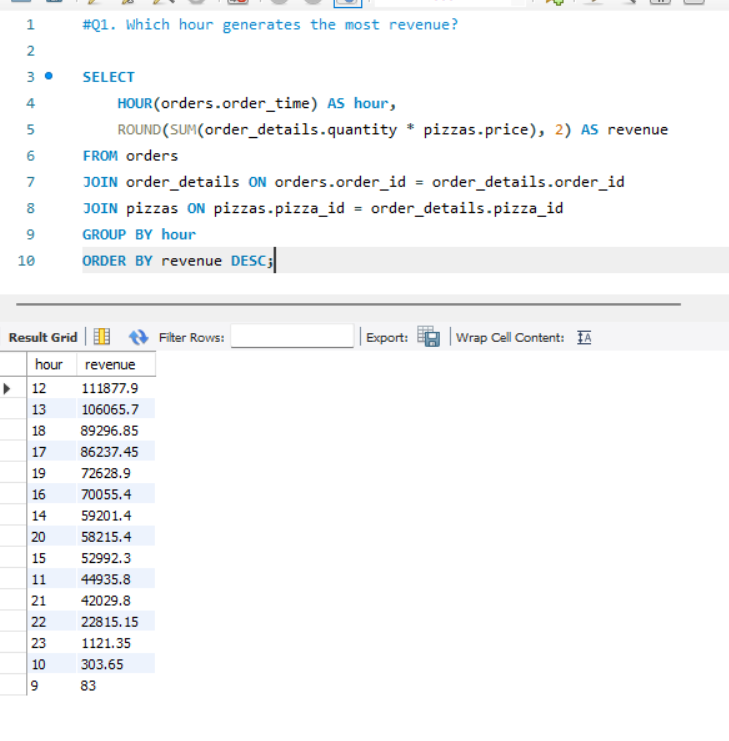
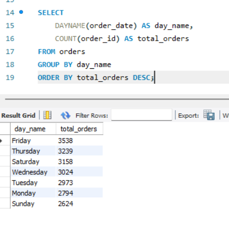
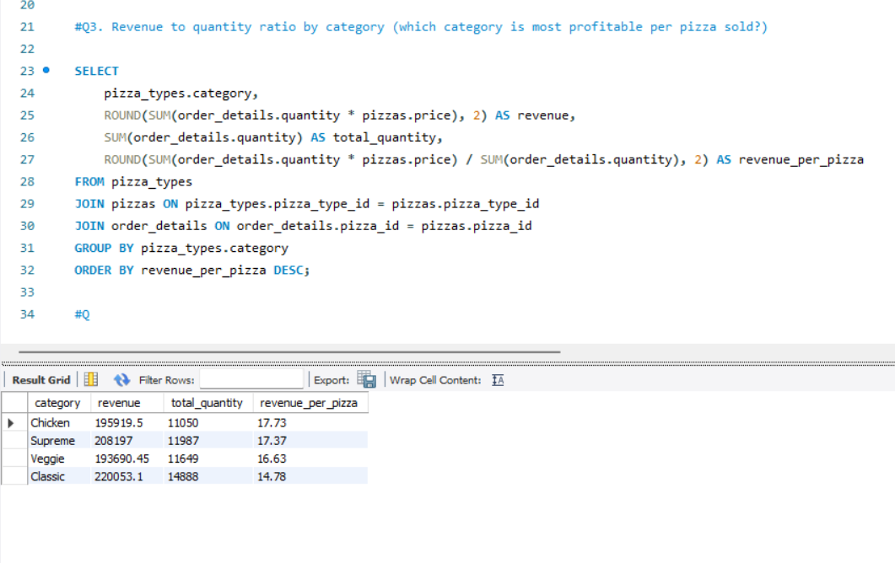
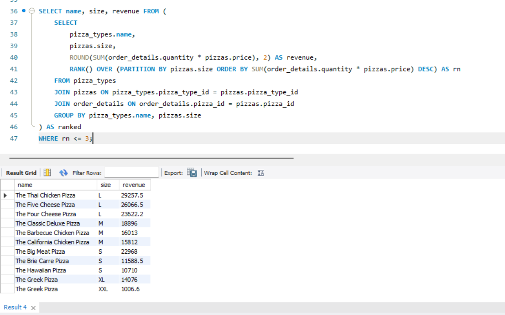
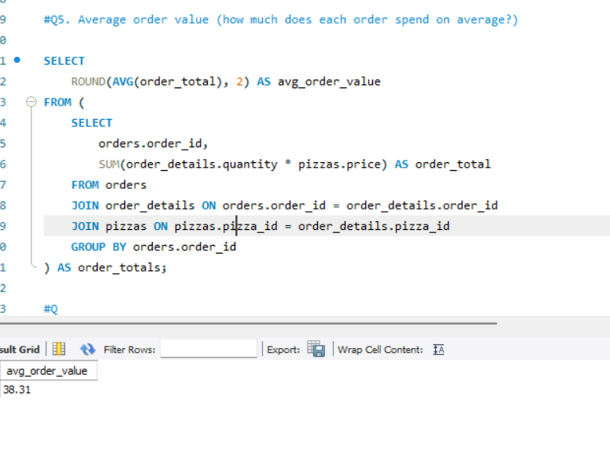
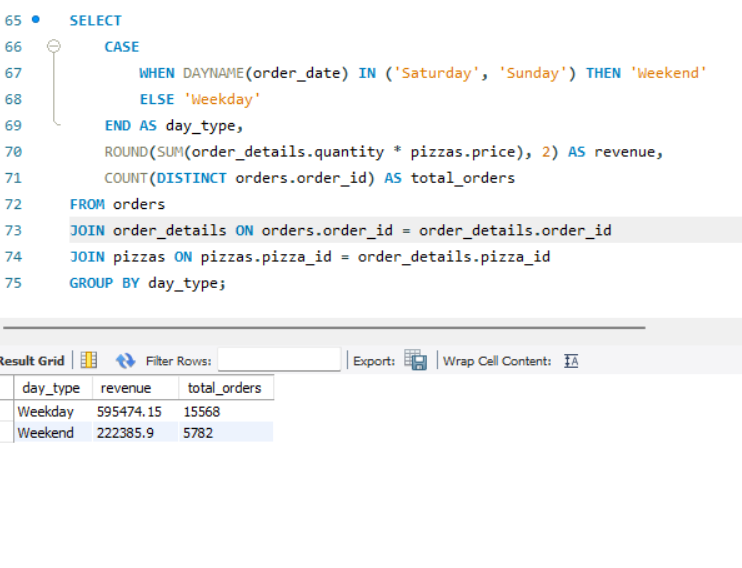
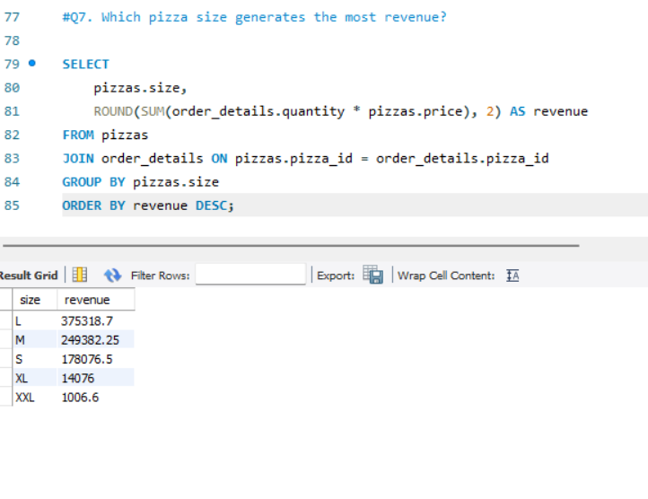

# Pizza Hut Sales Analysis

**Tools:** MySQL
**Data:** 21,350 orders · 48,620 order line items · 4 relational tables
**Skills shown:** Relational joins · Subqueries · Window functions (RANK) · CASE-based segmentation · Business question framing

## The One-Line Summary

Revenue is concentrated in a few predictable windows, lunch hour, weekdays, and Large pizzas, while the highest-selling pizza and the most profitable pizza per unit are not the same pizza.

## The Problem

Pizza Hut's transactional data is spread across four separate tables, orders, order details, pizzas, and pizza types, none of which answer a business question on their own. The goal was to join these tables correctly and answer seven real operational questions: when does revenue actually happen, which products carry the business, and where are the meaningful gaps between total volume and profitability.

This project answers seven questions:

1. Which hour of the day generates the most revenue?
2. Which day of the week has the most orders?
3. Which pizza category is most profitable per pizza sold?
4. What are the top 3 pizzas by revenue within each size category?
5. What is the average order value?
6. Do weekdays generate more revenue than weekends?
7. Which pizza size generates the most revenue?

## The Dataset

**Source:** Pizza Hut sales dataset
**Tables:** orders · order_details · pizzas · pizza_types
**Coverage:** 21,350 orders · 48,620 order line items · 96 pizza variants · 32 pizza types across 4 categories

| Table | What It Contains |
|---|---|
| orders | order_id, order_date, order_time |
| order_details | order_details_id, order_id, pizza_id, quantity |
| pizzas | pizza_id, pizza_type_id, size, price |
| pizza_types | pizza_type_id, name, category, ingredients |

## What I Built

**File:** `pizza_hut_SQL.sql`

All 7 questions are answered through direct joins across the four tables, with subqueries and a window function used where a single-pass GROUP BY wasn't enough:

- Q1, Q2, Q6, Q7 use straightforward joins and GROUP BY to aggregate revenue and order counts by hour, day, day-type, and size
- Q3 joins all three product tables to compute both total category revenue and a revenue-per-pizza ratio, the metric that actually reveals profitability rather than just volume
- Q4 uses a subquery with `RANK() OVER (PARTITION BY pizzas.size ORDER BY revenue DESC)` to find the top 3 pizzas within each size tier, not just the top 3 overall
- Q5 uses a subquery to first compute per-order revenue, then averages across orders, since order value has to be calculated at the order level before it can be averaged
- Q6 uses a CASE statement to bucket each order into Weekday or Weekend before aggregating

## Analysis and Findings

### Q1. Which hour generates the most revenue?

Revenue peaks sharply at 12pm ($111,878) and again at 1pm ($106,066), the lunch window. A second, smaller peak appears at 6pm ($89,297) for dinner. Lunch outperforms dinner as the primary revenue driver, not the reverse of what a casual dining assumption might suggest.

### Q2. Which day of the week has the most orders?

Friday leads with 3,538 orders, followed by Thursday (3,239) and Saturday (3,158). Sunday is the slowest day at 2,624 orders, about 26% fewer than Friday.

### Q3. Which pizza category is most profitable per pizza sold?

Classic generates the highest total revenue ($220,053), but Chicken generates the highest revenue per pizza sold ($17.73 vs $14.78 for Classic). Classic wins on volume, Chicken wins on margin per unit, these are two different stories and neither one alone tells the full picture.

### Q4. Top 3 pizzas by revenue within each size

The Thai Chicken Pizza leads Large at $29,258, the Big Meat Pizza leads Small at $22,968, and the Classic Deluxe leads Medium at $18,896. Notably, the same pizza, The Greek Pizza, appears in both the XL and XXL top spots, but XXL revenue is only $1,007 against XL's $14,076, showing how thin demand is at the largest size tier.

### Q5. What is the average order value?

The average order is worth $38.31, calculated by summing revenue per order first, then averaging across all 21,350 orders, not by dividing total revenue by total pizzas sold, which would conflate order size with order value.

### Q6. Do weekdays generate more revenue than weekends?

Weekdays generate $595,474 in revenue across 15,568 orders, compared to $222,386 across 5,782 orders on weekends, roughly 2.7 times more. This makes sense given there are 5 weekdays against 2 weekend days, but the per-day average still favors weekdays slightly (about $119,095/day vs $111,193/day), suggesting weekday demand isn't just a function of having more days.

### Q7. Which pizza size generates the most revenue?

Large dominates at $375,319, more than Medium ($249,382) and Small ($178,077) combined relative to XL and XXL. XXL is nearly nonexistent as a revenue driver at just $1,007, under 0.2% of total revenue.

## Key Findings

1. **Revenue is concentrated in two daily windows.** Lunch (12-1pm) outperforms dinner (6pm) as the primary revenue driver, with a sharp drop-off outside these windows.
2. **Friday is the busiest day, Sunday the slowest.** Order volume varies by roughly 26% between the two, worth factoring into staffing and inventory planning.
3. **Total revenue and per-unit profitability point to different products.** Classic leads on total revenue, but Chicken generates more revenue per pizza sold, a business optimizing for margin and a business optimizing for volume would make different product decisions from this same dataset.
4. **Weekdays generate roughly 2.7x weekend revenue**, and the per-day average still favors weekdays even after accounting for there being more weekdays than weekend days.
5. **Large is the dominant size by a wide margin**, while XXL is functionally a negligible product line, under 0.2% of total revenue despite appearing in the top-3-by-size rankings.

## Outputs

| File | Description |
|---|---|
| pizza_hut_SQL.sql | All 7 queries with business-question comments |
| orders.csv | Raw orders data (order_id, order_date, order_time) |
| order_details.csv | Raw order line items (order_id, pizza_id, quantity) |
| pizzas.csv | Pizza sizes and prices |
| pizza_types.csv | Pizza names, categories, and ingredients |

## How to Run

1. Create a MySQL database and load the four CSVs (`orders.csv`, `order_details.csv`, `pizzas.csv`, `pizza_types.csv`) into their corresponding tables.
2. Open `pizza_hut_SQL.sql` in MySQL Workbench (or your preferred client).
3. Run each query individually, they're independent and don't need to run in a specific order, each is commented with the business question it answers.

## About Me

Aiman Ishaq
Data analytics student building real projects on real data.

